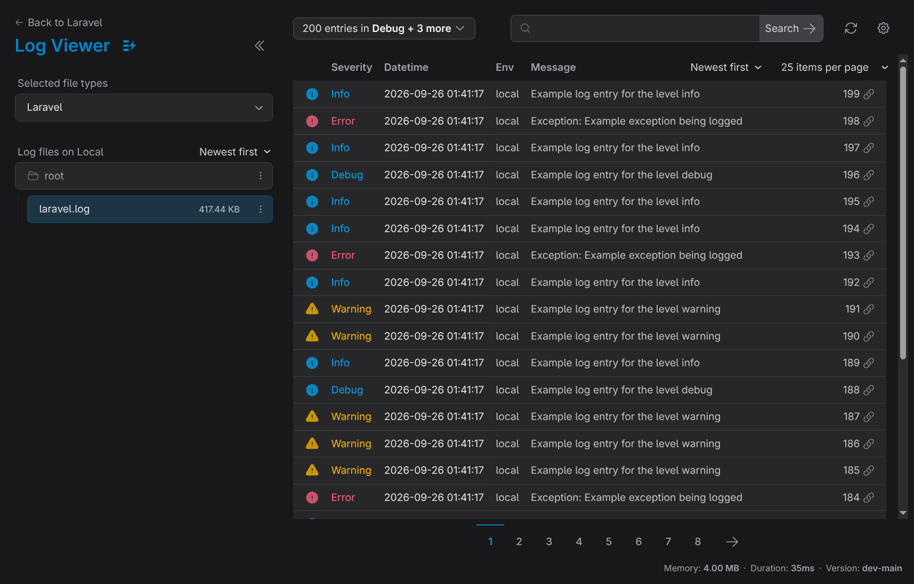

<div align="center">
    <p>
        <h1>Log Viewer<br/>Easy-to-use, fast, and beautiful</h1>
    </p>
</div>

<p align="center">
    <a href="#features">Features</a> |
    <a href="#installation">Installation</a> |
    <a href="#troubleshooting">Troubleshooting</a> |
    <a href="#credits">Credits</a>
</p>

<p align="center">
<a href="https://packagist.org/packages/wg-vn/trail-log-viewer"></a>
<a href="https://packagist.org/packages/wg-vn/trail-log-viewer"></a>
<a href="https://packagist.org/packages/wg-vn/trail-log-viewer"></a>
<a href="https://packagist.org/packages/wg-vn/trail-log-viewer"></a>
</p>




**Log Viewer** is a perfect companion for your [Laravel](https://laravel.com/) app.

You will no longer need to read the raw Laravel log files (and other types of logs) trying to find what you're looking for.

Log Viewer helps you quickly and clearly see individual log entries, to **search**, **filter**, and make sense of your Laravel logs **fast**. It is free and easy to install.

### Features

- 📂 **View all the Laravel logs** in your `storage/logs` directory,
- 📂 **View other types of logs** - Horizon, Apache, Nginx, Redis, Supervisor, Postgres, and more,
- 🔍 **Search** the logs,
- 🎚 **Filter** by log level (error, info, debug, etc.),
- 🔗 **Sharable links** to individual log entries,
- 🌑 **Dark mode**,
- 📱 **Mobile-friendly** UI,
- 🖥️ **Multiple host support**,
- ⌨️ **Keyboard accessible**,
- 💾 **Download & delete** log files from the UI,
- ☑️ **Horizon** log support (up to Horizon v9.20),
- ☎️ **API access** for folders, files & log entries,
- 💌 **Mail previews** for e-mails sent to the logs,
- and more...

## Get Started

### Requirements

- **PHP 8.5+**
- **Laravel 12+**

### Installation

To install the package via composer, Run:

```bash
composer require wg-vn/trail-log-viewer
```

After installing the package, publish the front-end assets by running:

```bash
php artisan log-viewer:publish
```

### Usage

Once the installation is complete, you will be able to access **Log Viewer** directly in your browser.

By default, the application is available at: `{APP_URL}/log-viewer`.

(for example: `https://my-app.test/log-viewer`)

### Demo

To try Log Viewer without installing it into an application, clone this repository and run:

```bash
composer install
composer demo
```

This starts a local Laravel app with sample logs at `http://127.0.0.1:8000/log-viewer` (or the next free port). Stop it with `Ctrl+C`.

## Configuration

To customize Log Viewer, publish the config file with `php artisan vendor:publish --tag="log-viewer-config"` and edit `config/log-viewer.php`. Each option is documented inline.

## Troubleshooting

Here are some common problems and solutions.

### Problem: Logs not loading

Log Viewer supports Laravel, Horizon, Apache, Nginx, PHP-FPM, Redis, Supervisor, and Postgres log formats out of the box. If your log has a custom format, you will need to define your own custom log parser.

If your logs are still not showing up, make sure the web process, which Log Viewer runs on, has permission to read these logs.

For example, if you want to read the Apache HTTP access logs in `/var/log/httpd`, you will need to make sure that your web process (apache/httpd) has permission to read these files. On unix systems, you can do this with [file ACLs](https://www.thegeekdiary.com/unix-linux-access-control-lists-acls-basics/#:~:text=Every%20file%20on%20any%20UNIX,their%20permission%20to%20the%20file).

## Changelog

Please see [CHANGELOG](CHANGELOG.md) for more information on what has changed recently.

## Security Vulnerabilities

Please review [our security policy](../../security/policy) on how to report security vulnerabilities.

## Credits

- [wg-vn](https://github.com/wg-vn)
- [All Contributors](../../contributors)

## License

The MIT License (MIT). Please see [License File](LICENSE.md) for more information.
